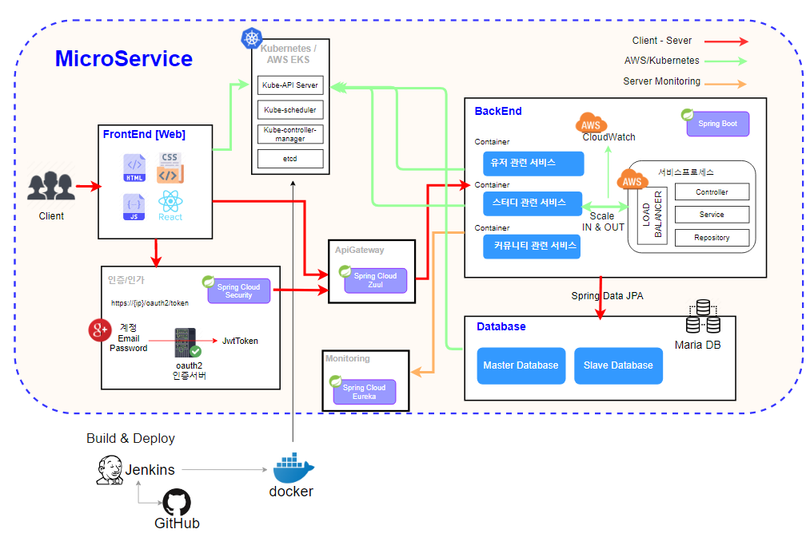

# modoo_study_BE

> 모두의 스터디 백엔드 github 페이지 입니다. 

## Language Version

**JAVA** 11.0.11

**SpringBoot** 2.3.12

## Information 

#### 화면 설계

https://ovenapp.io/project/R4MAqVUusk5iGRxXs7Nc7GKKkGx7gnHh#8gjg9

#### 요구사항 명세서

https://docs.google.com/spreadsheets/d/15ctI-zyCb5iYiDdUhi3Qm7I0Q3hfm7EwHiw3yH2_XXw/edit?usp=drive_web&ouid=110206749912638292887

#### ERD

https://app.diagrams.net/#G1VAYe_sMlg3f5Qwm_8sXNObFvos4lJOHb

#### Backend 구성도

https://www.notion.so/changmean/Backend-20613dc67dc34edfbda47890e5ba883d

## Architecture

## Branch

#### master

- 실제 배포

#### develop

- 개발 서버

#### feature_'기능 이름'

- 각 기능별 브랜치

## BuildFile

`buildFile` 폴더에 Spring 빌드파일 있습니다. 

#### **관련 설명**

https://www.notion.so/sonigane/Backend-20613dc67dc34edfbda47890e5ba883d

## MSA

apiGateway

- `branch` feature_apiGateway

- jwt토큰 기반 인증 및 apiGateway  서버 

mainStudy

- `branch` feature_mainStudy

- 메인페이지(스터디리스트), 내 스터디 관리

